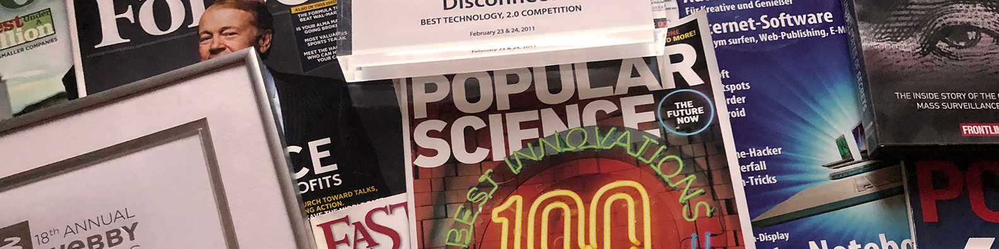

# Profile

**Cover image:**

**Profile photo:**

## Basic info

**First name:** Brian

**Last name:** Kennish

**Additional name:**

**Pronouns:**

**Headline:**

Vibe-coding repairman

## Current position

**Position:** CTO at Massive

**Show current company in my intro:** ✅

**Industry:** Internet

## Education

**School:** Brown University

**Show school in my intro:** ✅

## Location

**Country/Region:** United States

**Postal code:** 37201

**City:** Nashville, Tennessee

## Website

**Link:** https://oldestlivingboy.com/

**Link text:** Website

## About

I’m one of the founders of Massive, which is developing an alternative to ads and paywalls for
making money and paying online and was motivated by my frustrations as an app developer (and
internet user) over most of the last decade.

In that time, I created 7 independent apps – for iOS, Android, Chrome, Firefox, Safari, and Opera –
that’ve topped 1,000,000 active users and another 14 that’ve topped 10,000. Altogether, my apps have
been installed 20,000,000+ times, been rated an average of 4.5+ out of 5 stars by users, and been
featured 1,000+ times by the press and by platform vendors – including in Forbes[1], on 60
Minutes[2], and by Apple[3], Google[4], Mozilla[5], and Opera[6]. I’ve had, among them, an app named
one of the 100 best innovations by Popular Science[7], one of the 20 best Chrome extensions[8] and
20 best Firefox add-ons by Lifehacker[9], and the best technology at Launch[10].

I’ve also spoken about privacy and security at Defcon[11], about app development at Google I/O[12],
and about Disconnect at Launch[13] and my research has been published by The Wall Street Journal[14]
and CNN[15].

For more, see:

https://oldestlivingboy.com/
https://joinmassive.com/

Sources:

1. https://www.forbes.com/sites/kashmirhill/2013/07/24/dont-want-trackers-watching-your-web-and-smartphone-activity-this-start-ups-for-you/#
2. https://www.cbsnews.com/news/the-data-brokers-selling-your-personal-information/
3. https://itunes.apple.com/app/werd-derp/id1152646495
4. https://play.google.com/store/apps/details?id=com.rocketshipapps.adblockfast
5. https://blog.mozilla.org/addons/2014/02/01/february-featured-add-ons/
6. https://dev.opera.com/articles/extension-developer-interviews-disconnect/
7. https://web.archive.org/web/20140924121407/http://www.popsci.com/bown/2013/category/software
8. https://lifehacker.com/lifehacker-pack-for-chrome-our-list-of-essential-chrom-880863393
9. https://lifehacker.com/lifehacker-pack-for-firefox-our-list-of-the-essential-896766794
10. https://en.wikipedia.org/w/index.php?oldid=708343289&title=LAUNCH_Conference
11. https://youtu.be/BK_E3Bjpe0E
12. https://youtu.be/iVSR6gufMXI
13. https://youtu.be/oLA-LxV4OT0
14. https://www.wsj.com/articles/SB10001424052748704281504576329441432995616
15. http://www.cnn.com/2011/TECH/web/06/21/ad.tracking/index.html
